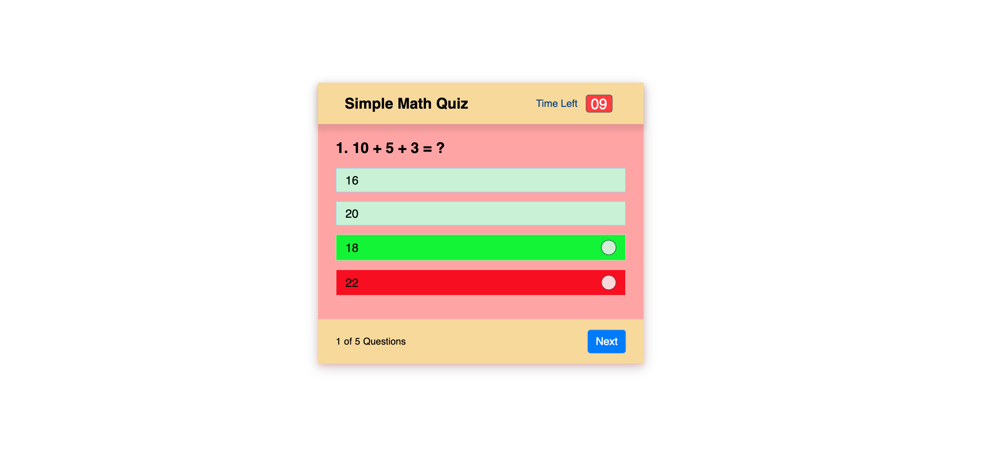

# Sample Math Quiz

## About me
I am GW coding bootcamp student, looking to solve problems, I have a passion for learning  and sharing my knowlege with other as publicaly as possible, if you found value in something I have created, please feel free to give me a shout out @Tariq_Stanikizai, fell free to reach out in case you want to just get in touch also.

## Purpose:
In this simple math quiz I create a simple Quiz App using JavaScript. A simple Quiz App that contains a set of curated questions and its answers and checks for the correctness of the answer given by the user.

## Simple Math Quiz app Features :
Multiple Choice Option.
Timer Features.
Random Features,
Time Limited

## Technology in Used :
* HTML
* CSS
* JAVA SCRIPT

The following image demonstrates the application functionality:

## Usage:
This should only be used as an exploration or educational project.

## Links:

* The URL of the deployed application.
 https://tariqstanikzai.github.io/Simple-Math-Quiz-Dev/

* The URL of the GitHub repository.
 https://github.com/Tariqstanikzai/Simple-Math-Quiz-Dev/tree/main

## Contact
 * @tariq_stanikzai
